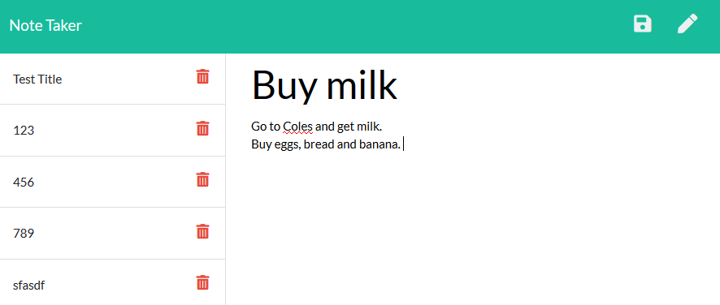

# NoteTaker

## Description 
An application that can be used to write, save, and delete notes. This application uses an express backend and save and retrieve note data from a JSON file

## Usage
1. Open this URL in your web browswer. 
https://note-taker-takuji.herokuapp.com/

2. Click "Get Started" to proceed. 

3. Edit and view notes. 

## Heroku 
Heroku is linked with this Github repository and 'Automatic deployment' has been enabled on heroku side. 
Any code pushed to github is automatically deployed to heroku. 

## Credit 
* node.js 
* heroku - The application has been deployed to heroku
* Backend was developed by tak-9. Used the course material for front-end.
* Delete and Save confirmation dialog boxes have been added to the front-end. 

## Screen Capture
